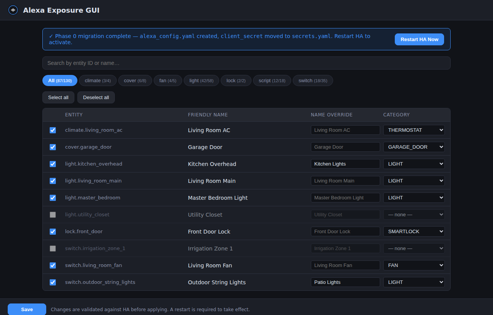
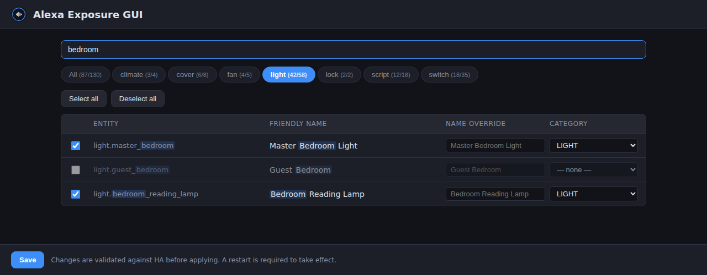

# Alexa Exposure GUI — Home Assistant Add-on

A Home Assistant add-on that gives you a web GUI to control exactly which HA entities are exposed to your **custom Alexa Smart Home skill** — no more hand-editing YAML.

[](https://www.home-assistant.io)
[](alexa-exposure-gui/config.yaml)
[](LICENSE)

---

## Screenshots

### Main view — all 130 entities across domain tabs



### Filtered view — search within a specific domain tab



---

## Features

| Feature | Details |
|---|---|
| **Phase 0 migration** | Automatically extracts your inline `alexa:` block from `configuration.yaml` into a managed `alexa_config.yaml` and moves `client_secret` to `secrets.yaml` — one-time, idempotent, rolls back on any failure |
| **Domain tabs** | Filter entities by domain (light, switch, fan, climate, lock, cover, script) |
| **Search** | Live search by entity ID or friendly name |
| **Bulk select / deselect** | Flip all visible entities at once |
| **Name override** | Send Alexa a different name than the HA friendly name |
| **Display category** | Set the Alexa device category (LIGHT, SWITCH, THERMOSTAT, SMARTLOCK, GARAGE\_DOOR, etc.) |
| **Safe writes** | Runs `ha core check` before every save; auto-restores timestamped backup on failure |
| **Ingress-only** | Served through HA authentication — no LAN port exposed |
| **Alexa Exposure sidebar panel** | Appears in the HA sidebar with the Amazon Alexa icon |

---

## Installation

### Via HA Add-on Store (recommended)

1. In Home Assistant open **Settings → Add-ons → Add-on Store**
2. Click **⋮ (overflow menu) → Repositories**
3. Add: `https://github.com/btoth525/ha-addon-alexa-gui`
4. Find **Alexa Exposure GUI** in the new repository section → **Install**
5. Review options (defaults are correct for most setups) → **Start**
6. Click **Open Web UI** — or find **Alexa Exposure** in your HA sidebar

---

## Configuration

| Option | Default | Description |
|---|---|---|
| `ha_config_path` | `/homeassistant` | Path to your HA config directory |
| `relocate_secret` | `true` | Move `client_secret` from inline YAML to `secrets.yaml` during Phase 0 migration |
| `auto_restart_after_apply` | `false` | Automatically restart HA Core after a successful save |
| `backup_dir` | `/homeassistant/alexa_gui_backups` | Directory for timestamped backups before every write |

---

## How it works

1. **First start** — detects whether your `configuration.yaml` has an inline `alexa:` block
2. **Phase 0 migration** (one-time) — extracts it to `alexa_config.yaml`, optionally moves `client_secret` to `secrets.yaml`, validates the new config via `ha core check`, then replaces the inline block with `!include alexa_config.yaml`
3. **GUI** — reads `alexa_config.yaml` and lists all Alexa-compatible entities from the HA states API; you check/uncheck and set overrides
4. **Save** — writes the updated `alexa_config.yaml`, runs `ha core check`; if it fails the backup is restored and no restart is triggered
5. **Restart** — you restart HA (manually or via the "Restart HA Now" button) for changes to take effect; a reminder to re-run Alexa device discovery is shown after restart

---

## Requirements

- Home Assistant OS or Supervised (add-on supervisor required)
- An existing `alexa:` integration block in `configuration.yaml` (from a custom Alexa Smart Home skill setup)
- Architecture: `amd64` or `aarch64`

---

## Sidebar panel

The add-on registers an **Alexa Exposure** panel in the HA sidebar using `mdi:amazon-alexa`. No manual Lovelace configuration needed.

---

## Full documentation

See [alexa-exposure-gui/DOCS.md](alexa-exposure-gui/DOCS.md) for full documentation including the migration details, backup/restore behaviour, and API endpoints.

---

## Repository structure

```
ha-addon-alexa-gui/
├── repository.yaml            # HA add-on repository manifest
├── alexa-exposure-gui/        # The add-on
│   ├── config.yaml            # Add-on manifest
│   ├── Dockerfile
│   ├── icon.png               # 256×256 add-on icon
│   ├── logo.png               # Landscape logo for the store
│   ├── app/                   # FastAPI backend
│   │   ├── main.py
│   │   ├── yaml_ops.py        # Phase 0 migration + YAML read/write
│   │   ├── ha_client.py       # Supervisor API calls
│   │   └── models.py          # Pydantic models
│   └── www/                   # Frontend (served as static files)
│       ├── index.html
│       ├── app.js
│       └── style.css
└── docs/screenshots/          # README screenshots
```
